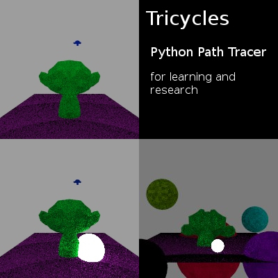
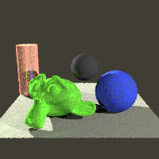

#Tricycles

Hi!!
Trying to understand how Cycles works I've decided to port some code I found
in the web to Python and do an small Path Tracer as an Addon for developers
interested to understand how Cycles work, and maybe even do quick test on the
Python implementation before jump to C code. I've named it Tricycles :P

- Trycicles works in parallel with other render engines, you don't need to select it on the Render Engine option
- The render button is in the Image Editor area, you need to create an image with the size you want to render (100x100 recommended)
- Only Point light supported
- The color of the objects is set via "color" option on Object panel
- On the Object panel -> Tricycles panel you will find the reflection option (The object need to be grey. The reflection is almos invisible)
- On the Render panel -> Tricycles panel you will find the Sampling, Blur and Bounces options. 

While the Engine is a Path Tracer, i think currently is not exactly like cycles:

- Cycles add a sample per pixel, until the render is complete (Tricycles add all samples to every pixel at the first pass)
- Cycles is ruled by the Energy Conservation law (I think Tricycles not) 

 You can find the code I've used here:
 
- http://iquilezles.org/www/articles/simplepathtracing/simplepathtracing.htm
- http://answers.unity3d.com/questions/449606/rotate-a-ray-to-camera-direction-in-a-cg-shader.html
- http://people.cs.kuleuven.be/~philip.dutre/GI/TotalCompendium.pdf

##TODO

- Add some basic properties to objects to set the Shader
- Get camera rotation (Only position works now)
